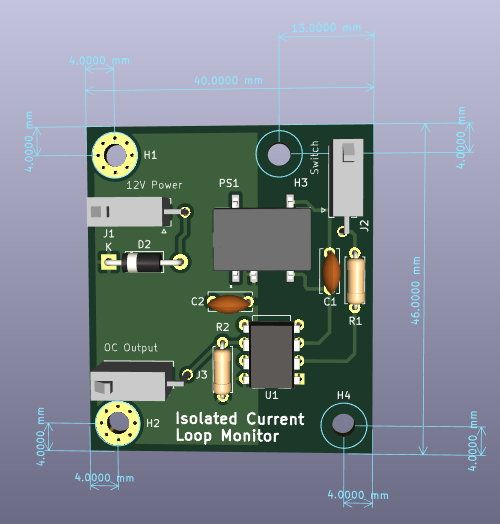

<h1> Isolated Current Loop Monitor </h1>

 This circuit monitors the state of a switch (or many switches in series) with an isolated signal. This is the only way to truly monitor the state of a switch without any
information about the signal that the switch is switching. 

<h3>Inputs</h3>
<ul>
<li>12V Power</li>
<li>Switch Loop (Connect each end to switch connector)</li>
</ul>
<h3>Output</h3>
The output is open collector with a 10k pull up resistor. When the 
switch loop is closed, the open collector pulls low, and when the switch
is open, it releases. 